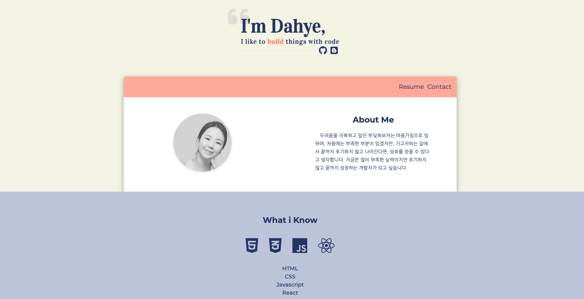

# PortFolio 

## 포트폴리오에 사용한 기술
- html, css, javascript를 사용했습니다.

## 프로젝트 기능
- 상단 깃헙/티스토리 아이콘 : 바로가기 아이콘
- About Me : 간단한 포부 및 자기 소개
- Resume : 자기 소개 및 이력서 바로가기 
- What i know : 공부한 기술 및 보유 기술
- Contact : 이메일 보내기 폼/ 이메일 주소를 클릭하면 자동으로 복사되는 스크립트 추가
- My Projects : 공부한 프로젝트 

## 포트폴리오 바로가기
- 주소 : https://dahyeblog.github.io/Portfolio_DAHYE/

## 포트폴리오 미리보기

</img>

## 참고한 css 자료
- BOX shadow : https://getcssscan.com/css-box-shadow-examples

 